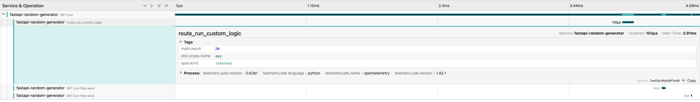
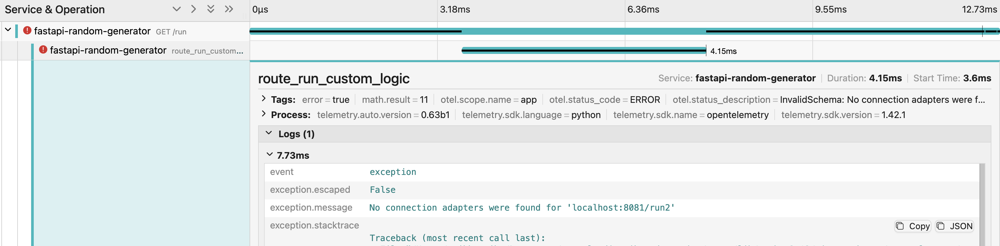
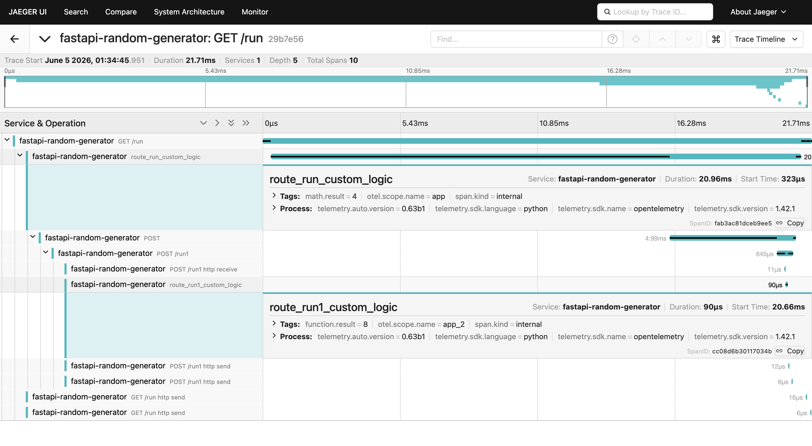
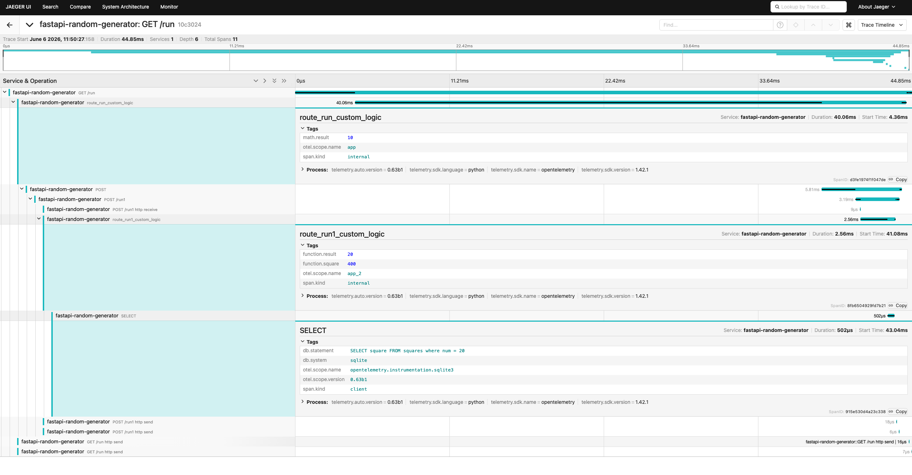

# example-distributed-tracing
example repository for distributed tracing implementation

## Setup
- Install 'uv'
- Setup the environment using `uv venv`
- Install libraries from the `lock` file or `pyproject.toml` using `uv sync`

## Simple Auto Instrumentation Example
- Open the first terminal and run this command
    ```bash
    OTEL_PYTHON_LOGGING_AUTO_INSTRUMENTATION=true opentelemetry-instrument \
        --traces_exporter console \
        --metrics_exporter console \
        --logs_exporter console \
        uvicorn app:app --host 0.0.0.0 --port 8000
    ```
- **Note:** `opentelemetry-instrument` is important to allow automatic instrumentation of all the installe libraries
- Send a request from the second terminal `curl http://0.0.0.0:8000/run_simple`
- In the first terminal, logs will come along with a large `JSON` containing trace information

## Visualize in Jaeger
- Download `Jaeger` using `docker pull jaegertracing/all-in-one`
- Run `Jaeger` using
    ```bash
    docker run --rm --name jaeger \
    -p 16686:16686 \
    -p 4317:4317 \
    -p 4318:4318 \
    jaegertracing/all-in-one
    ```
- A UI can now be accessed at `http://localhost:16686/`
- Run the app using the below command
    ```bash
    opentelemetry-instrument \
        --service_name fastapi-random-generator \
        --traces_exporter otlp \
        --metrics_exporter otlp \
        uvicorn app:app --host 0.0.0.0 --port 8000
    ```
- Run a `cURL` request `curl http://0.0.0.0:8000/run_simple` and visualize the results in `Jaeger`


## More experiments
### Error view
Error view in Jaeger



### Trace across servers
- In terminal 1, run
    ```bash
    opentelemetry-instrument \
        --service_name fastapi-random-generator \
        --traces_exporter otlp \
        --metrics_exporter otlp \
        uvicorn app:app --host 0.0.0.0 --port 8000
    ```
- In terminal 2, run
    ```bash
    opentelemetry-instrument \
        --service_name fastapi-random-generator \
        --traces_exporter otlp \
        --metrics_exporter otlp \
        uvicorn app_2:app --host 0.0.0.0 --port 8000
    ```
- In terminal 3, run Jaeger using the earlier command
- Trace across hops is visible
    

### Introduce Local DB
- Check this [README](local_db_setup/README.md) to setup a local database
- Run the same commands as the section _Trace across servers_
- Trace will now also contain information about the `SQLite3` connection
    
